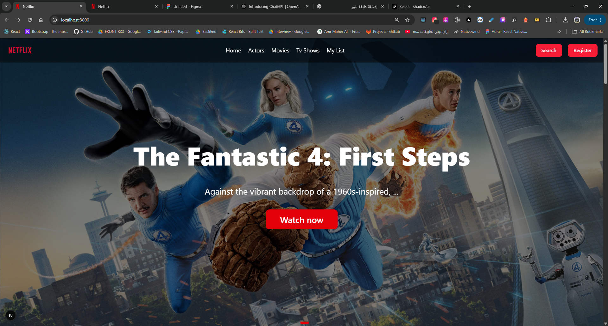
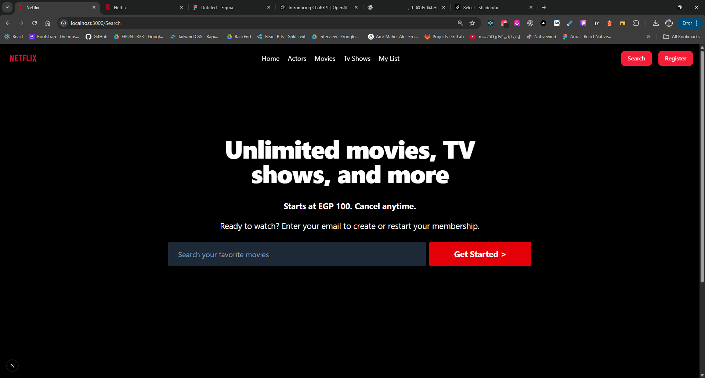
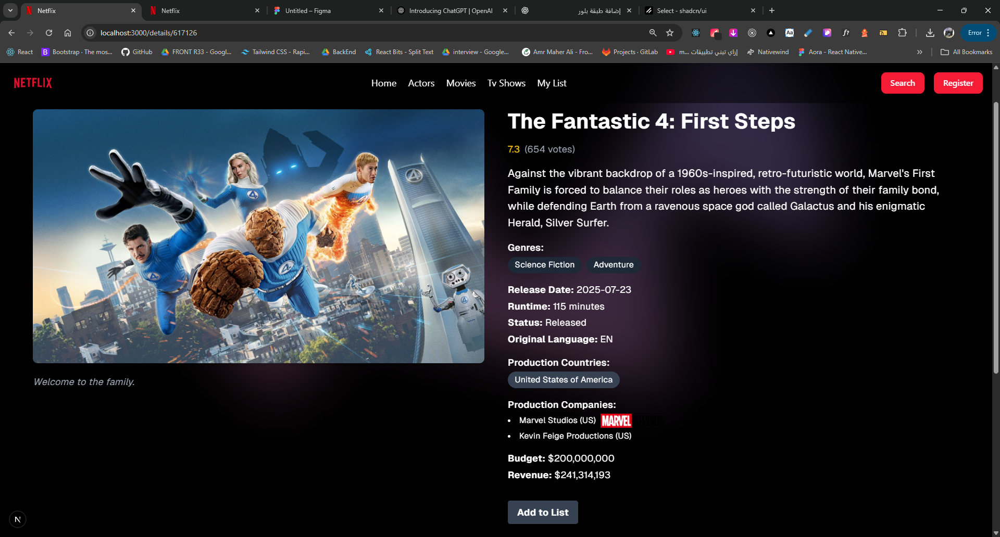
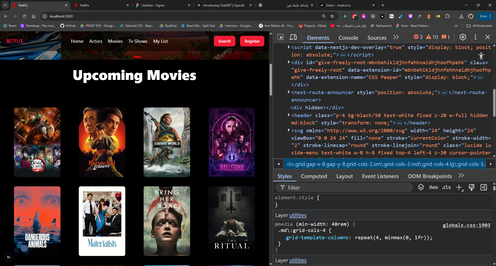
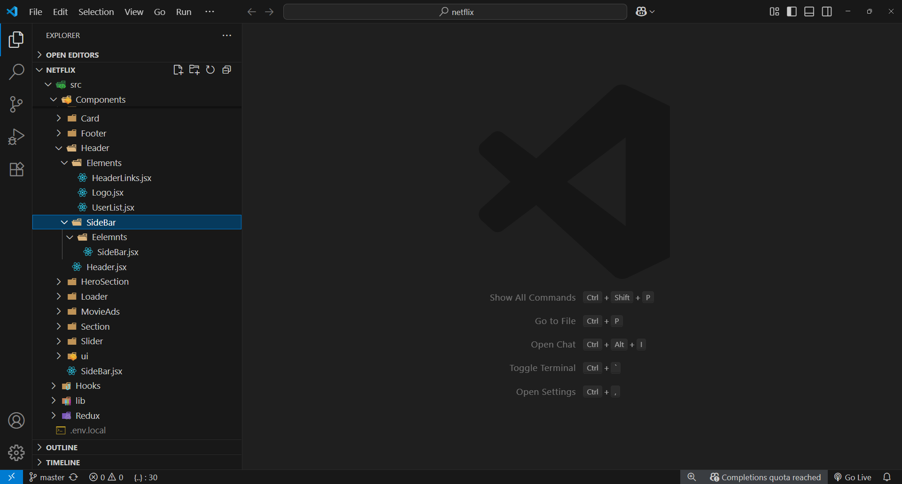
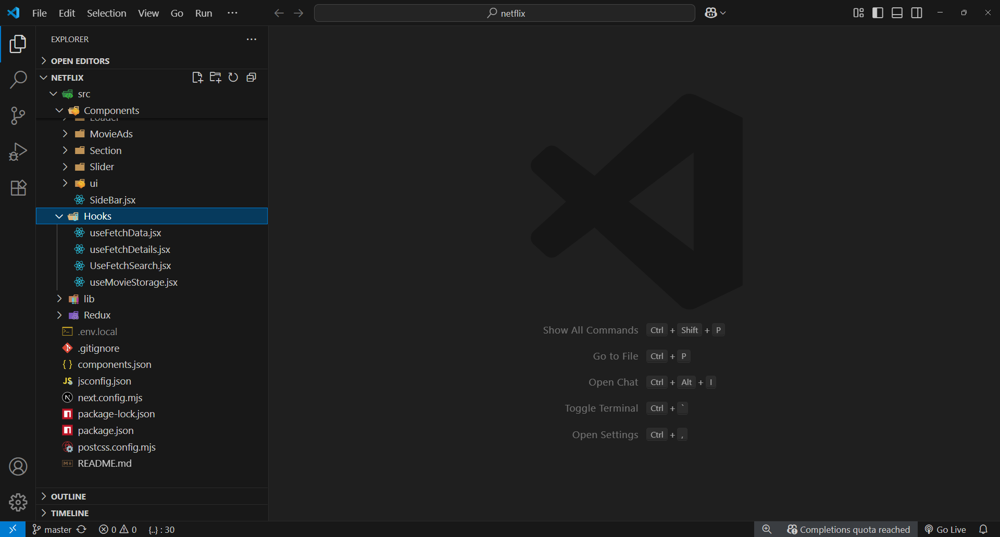

# Netflix 🎬

A fully responsive Netflix-like web app built using Next.js, Tailwind CSS, and TMDB API.

## 🔧 Technologies Used

### ⚙️ Framework & Core Libraries
- **Next.js** – React framework for production.
- **React** – Core UI library.
- **React DOM** – DOM rendering for React.

### 🎨 Styling & UI
- **Tailwind CSS** – Utility-first CSS framework.
- **tw-animate-css** – Tailwind animation utilities.
- **@tailwindcss/postcss** – Tailwind support for PostCSS.
- **lucide-react** – Modern icon set.
- **swiper** – Modern mobile touch slider.
- **@radix-ui/react-navigation-menu** – Accessible navigation menu.
- **@radix-ui/react-select** – Custom select dropdowns.
- **@radix-ui/react-slot**
- **@radix-ui/react-tooltip** – Accessible tooltips.
- **class-variance-authority** – Manage class variance.
- **clsx** – Conditionally join classNames.
- **tailwind-merge** – Merge Tailwind classes without conflict.

### 🌐 API & Data Handling
- **axios** – Promise-based HTTP client for the browser.
- **@tanstack/react-query** – Powerful asynchronous state management.

### 🧠 Forms & Validation
- **formik** – Forms in React with ease.
- **yup** – JavaScript schema validation.

### 💫 Animations
- **motion** – Simple and powerful animations.

### 🌍 Icons
- **@fortawesome/fontawesome-svg-core**
- **@fortawesome/free-brands-svg-icons**
- **@fortawesome/react-fontawesome**

## 📡 API Used

The app uses the [TMDB API](https://www.themoviedb.org/documentation/api) to fetch movie data including:

- **Trending movies** (`/trending/all/week`)
- **Top Rated movies** (`/movie/top_rated`)
- **By Genre** (`/discover/movie?with_genres=`)
- **Search** (`/search/movie`)
- **Movie Details** (`/movie/{movie_id}`)

You need a TMDB API key. Create a `.env.local` file with:

```bash
NEXT_PUBLIC_TMDB_API_KEY=your_api_key_here
```

---

## 📁 Folder Structure

Typical structure for components, pages, and hooks.

---

## 📸 Screenshots

### 🏠 Home Page


### 🔍 Search / Filter


### 📄 Details Page


### 📱 Responsive Design


### 🧩 Micro Frontend Isolation


### ⚙️ Custom Hook Example



## 🚀 Getting Started

Install dependencies:

```bash
npm install
```

Run the development server:

```bash
npm run dev
```

---

## 📝 License

This project is for educational purposes only.

## Additional Technologies Used

- 🧩 **Custom Hooks**: Utilized to encapsulate and reuse logic across multiple components.
- 🏗️ **Micro Frontends Architecture**: Applied to split the app into independently deployable and maintainable frontend modules.

